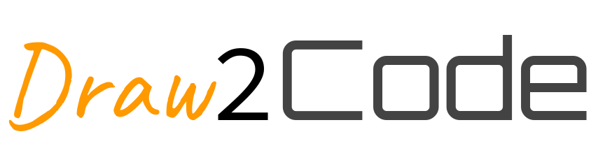
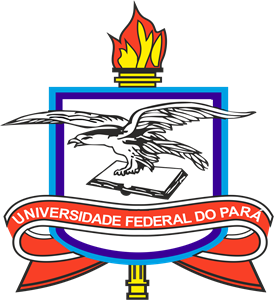

DrawToCode receives an UML diagram from [Draw.io](https://www.draw.io/) and 
makes code from it. 

## Getting Started 

We don't have the intent to cover all Draw.io features and all programming
languages, to know what you can
use, go to the [Wiki](https://github.com/CoffeeOverflow/DrawToCode/wiki).

### Programming Languages Accepted

* Python
* Java

You can add another language by following the instructions on the 
[Wiki](https://github.com/CoffeeOverflow/DrawToCode/wiki).

### Prerequisites

* Python 3.6.7+

Install required packages by:

```bash
pip install -r requirements.txt
```

### Usage

```bash
python main.py --help
```

#### Example

```
python main.py --xml_file=orc.xml --code_path=/tmp/orc/ --language=python
```

## Running the Tests

```bash
pytest-3 tests/
```

#### Show Coverage

```bash
pytest-3 --cov=src/ tests/
```

## Contributing

Feel free to fork the project, we do not have the intent to close issues or
accept pull requests.

## Authors

### [CoffeOverflow Team](https://github.com/CoffeeOverflow)

* [Aian Shay](https://github.com/aianshay)
* [Pedro Victor](https://github.com/Arouck)
* [Renan Cunha](https://github.com/renan-cunha)
* [Vitor Cantão](https://github.com/VitorCantao)

## License

This project is licensed under the MIT License - see the [LICENSE](https://github.com/CoffeeOverflow/DrawToCode/blob/master/LICENSE) file 
for details.

## Acknowledgments

This repository was developed as the final project of the [Project Analysis and
Design](http://gustavopinto.org/teaching/pad) course, with the guidance of [Gustavo Pinto](https://github.com/gustavopinto),
a professor at the Federal University of Pará.

[](https://portal.ufpa.br/ "Visite o site da UFPA")
